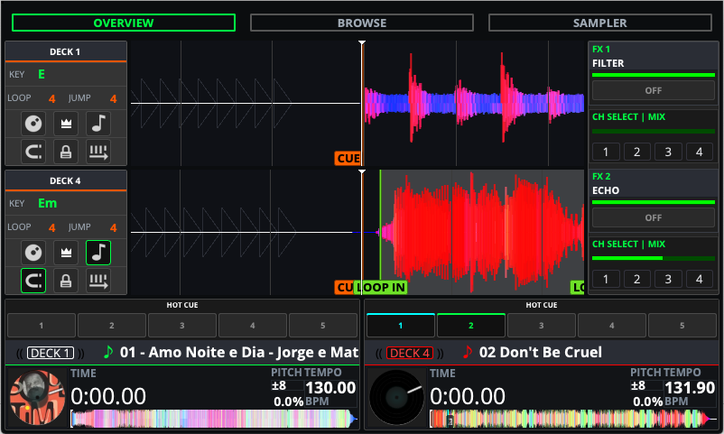
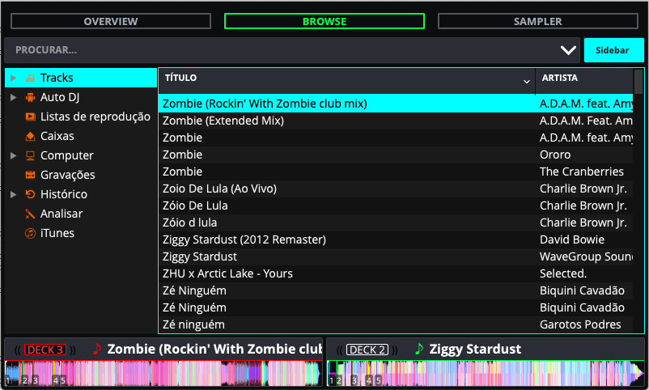

This project is a fork of [schmic/Pioneered](https://github.com/schmic/Pioneered), which is originally a fork of [timewasternl/Pioneered](https://github.com/timewasternl/Pioneered).

**Numarkered** is an Engine DJ / Numark inspired theme for Mixxx, meticulously optimized for smaller screen resolutions like 5-inch Raspberry Pi displays (WVGA 800x480). It has been designed to act as a standalone screen extending the **Numark NS6** 4-channel MIDI controller.

## Screenshots

## Features

- **Engine DJ Aesthetic:** Pitch black background with high-contrast Cyan accents for instant readability in dark environments.
- **Hardware-Synced Layout:** \* Features **5 numbered Hotcues** instead of the standard 8, perfectly matching the physical buttons of the Numark NS6.
  - **BeatFX Section:** Rebuilt for dual FX units (FX1 & FX2) with 4-channel assign buttons, mapping flawlessly to the NS6 effect knobs and routing.
- **Compact Responsiveness:** Fully scalable with a strict minimum resolution of `800x450`. The layout uses dynamic proportions to prevent overlapping on 5" Raspberry Pi screens.
- **Tabbed Navigation:** Clean top bar to switch between Overview, Browse (Library), and Samplers.
- **Lightweight:** Barely any resources = Small footprint for single-board computers!

## Install

Drop the `Numarkered` folder in `<MIXXX_FOLDER>/skins` and select it from `Preferences > Interface`.

Alternatively, you can use the `install.linux.sh` script to automatically install the skin to `~/.mixxx/skins/`.

## Contributors

- [MauroJuniorr](https://github.com/maurojuniorr) (Numarkered Fork & NS6 Engine DJ adaptation)

### Previous Upstream Authors & Contributors

- [schmic](https://github.com/schmic) (Pioneered Fork)
- [timewasternl](https://github.com/timewasternl) (Original Pioneered creator)
- [GorgiAstro](https://github.com/GorgiAstro)
- [BvOBart](https://github.com/bvobart)
- [bencejuhaasz](https://github.com/bencejuhaasz)
